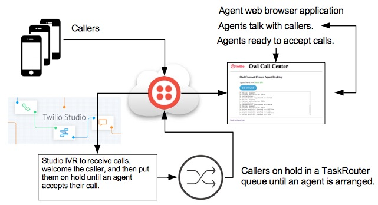

# Owl Contact Center Version 2



[](https://heroku.com/deploy?template=https://github.com/tigerfarm/owlcc)

When you deploy to Heroku, you will be prompted for an app name. The name needs to be unique,
example, enter your name+cc (example: davidcc). Click Deploy app. Once the application is deployed, click Manage app.
Set Heroku project environment variables by clicking Settings.
Click Reveal Config Vars. Add the following key value pairs:
```
ACCOUNT_SID=your_account_SID
AUTH_TOKEN=your_account_auth_token
WORKSPACE_SID=your_TaskRouter_workspace_SID
```

## Files

Agent desktop website:
- [index.html](index.html) : Home page
- [agent_list.php](agent_list.php) : List TaskRouter worker agents and their status. An agent will click their name to display their desktop.
- [agent_desktop.css](agent_desktop.css) : Agent desktop to set their status and monitor their call messages.
- favicon.ico

[Twilio PHP Helper Library](https://www.twilio.com/docs/libraries/php) directory:
- twilio-php-master : Downloaded and unzipped into this directory. This is the version without Composer.

For a localhost setup, creating environment variables and testing the setup:
- [setvars.sh](setvars.sh) : Set the environment variables.
- [echoVars.php](echoVars.php) : Echo the environment variables. Test the Twilio Helper Library installation and the TaskRouter configurations.

README.md : this file

Heroku Hosting Service configurations
- [app.json](app.json) : Heroku deployment file to describe the application.
- [composer.json](composer.json) : Heroku deployment file which sets the programming language used.

## Setup Steps to Run on your Local Host.

Download this repository's zip file and unzip it into a work directory.
Example work directory:
```
/Projects/OwlCc
```

Note, the Twilio PHP helper library is included in the subdirectory:
```
/Projects/OwlCc/twilio-php-master
```

In the project directory, edit setvars.sh and add your values.
```
ACCOUNT_SID=your_account_SID
AUTH_TOKEN=your_account_auth_token
WORKSPACE_SID=your_TaskRouter_workspace_SID
```

Set your terminal session's environment variables.
```
$ source ./setvars.sh
+++ Set variables.
+ Variables set.
---------------------------------------
+++ Echo environment variables and test the environment.
+ ACCOUNT_SID   : your_account_SID
+ AUTH_TOKEN    : your_account_auth_token
+ Test the loading and using of the Twilio PHP helper library.
+ Twilio PHP Helper Library Client is working.
---------------------------------------
+ Worker SID for testing the generation of tokens: your_TaskRouter_worker_SID
+ Worker Client token created.
+ WORKSPACE_SID : your_TaskRouter_workspace_SID
+ Worker token created.
--------------------------------------- 
```

Also, in echoVars.php, workerSid to one of your TaskRouter workers.
```
$workerSid = "WK10ec1823ae8a54d715ba424599ea473f";
```

Run the PHP HTTP server using port 8000.
```
$ php -S localhost:8000
```

Test that it works. In your browser, goto: http://localhost:8000.
The Owl CC home pages is displayed.

In another terminal window, run Ngrok to allow notifications of incoming agent calls.
```
$ /Users/dthurston/Applications/ngrok http 8000
...
```

Connect as an agent by going to the Ngrok URL, example:
```
http://706bf85f.ngrok.io/agent_list
```

